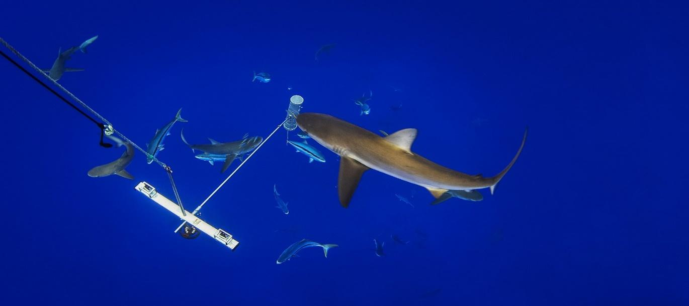

<a href="mailto:pjbouchet@gmail.com">Phil Bouchet</a>, Jessica Meeuwig, Charlie Huveneers, Tim Langlois, Tom Letessier, Michael Lowry, Matt Rees, Julia Santana-Garcon, Molly Scott, Matthew Taylor, Christopher Thompson, Laurent Vigliola & Sasha Whitmarsh

 

Image Source: Manu San Félix from the National Geographic Society (Pristine Seas Programme) 2014
 
 
<strong>Chapter citation:</strong> Bouchet P, Meeuwig J, Huveneers C, Langlois T, Letessier T, Lowry M, Rees M, Santana-Garcon J, Scott M, Taylor M, Thompson C, Vigliola L, Whitmarsh S. 2020. Marine sampling field manual for pelagic BRUVs (Baited Remote Underwater Videos). In <i>Field Manuals for Marine Sampling to Monitor Australian Waters, Version 2</i>. Przeslawski R, Foster S (Eds). National Environmental Science Program (NESP). 

| Chapter Contents                                                                                                           |
|----------------------------------------------------------------------------------------------------------------------------|
|  **[Platform Description](https://pelagic-bruvs-field-manual.github.io/platform-description)**                             | 
|  **[Scope](https://pelagic-bruvs-field-manual.github.io/scope)**                                                           |   
|  **[Pelagic BRUVs in Marine Monitoring](https://pelagic-bruvs-field-manual.github.io/pelagic-bruvs-in-marine-monitoring)** |
|  **[Equipment](https://pelagic-bruvs-field-manual.github.io/equipment)**                                                   |
|  **[Pre-Survey Preparations](https://pelagic-bruvs-field-manual.github.io/pre-survey-preparations)**                       |
|       _[Methodology](https://pelagic-bruvs-field-manual.github.io/pre-survey-preparations#methodology)_                    |
|       _[Pre-survey checklist](https://pelagic-bruvs-field-manual.github.io/pre-survey-preparations#pre-survey-checklist)_  |
|  **[Field Procedures](https://pelagic-bruvs-field-manual.github.io/field-procedures)**                                     |   
|       _[Calibrations](https://pelagic-bruvs-field-manual.github.io/field-procedures#calibrations)_                         |
|       _[Arrival on site](https://pelagic-bruvs-field-manual.github.io/field-procedures#arrival-on-site)_                   |
|       _[Deployment](https://pelagic-bruvs-field-manual.github.io/field-procedures#deployment)_                             |
|       _[Retrieval](https://pelagic-bruvs-field-manual.github.io/field-procedures#retrieval)_                               |
|  **[Post-survey Procedures](https://pelagic-bruvs-field-manual.github.io/post-survey-procedures)**                         | 
|       _[Data management](https://pelagic-bruvs-field-manual.github.io/post-survey-procedures#data-management)_             |
|       _[Quality control](https://pelagic-bruvs-field-manual.github.io/post-survey-procedures#quality-control)_             |
|       _[Video processing](https://pelagic-bruvs-field-manual.github.io/post-survey-procedures#video-processing)_           |
|       _[Data release](https://pelagic-bruvs-field-manual.github.io/post-survey-procedures#data-release)_                   |   
|  **[Forthcoming Developments](https://pelagic-bruvs-field-manual.github.io/forthcoming-developments)**                     | 
|  **[Field Manual Maintenance](https://pelagic-bruvs-field-manual.github.io/field-manual-maintenance)**                     |  
|  **[Acknowledgements](https://pelagic-bruvs-field-manual.github.io/acknowledgements)**                                     | 
|  **[References](https://pelagic-bruvs-field-manual.github.io/references)**                                                 |                                 

<a href="#" class="scrollUpButton">Back to top</a>
